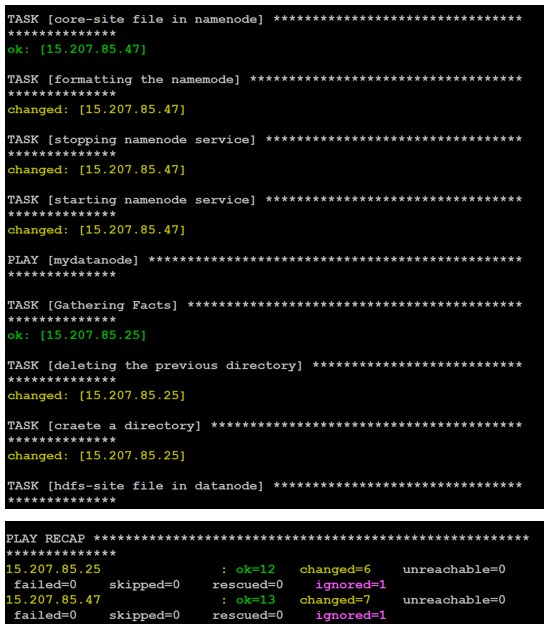

# ARTH - Task 11 👨🏻‍💻

Writing a playbok forConfiguring hadoop cluster over AWS using Ansible automation technology.

#HADOOP #ANSIBLE #AWS

Task Description📄

Configure Hadoop and start cluster services using Ansible Playbook
 

MediumLink:
https://akshay-anil-blogs.medium.com/rh294-ansible-automation-configuring-hadoop-cluster-in-one-click-5a8bd2d6414d

YoutubeLink:
https://youtu.be/nEPTxHsZFSY

Website:
https://akshayanil1080.github.io/mywebsite/

